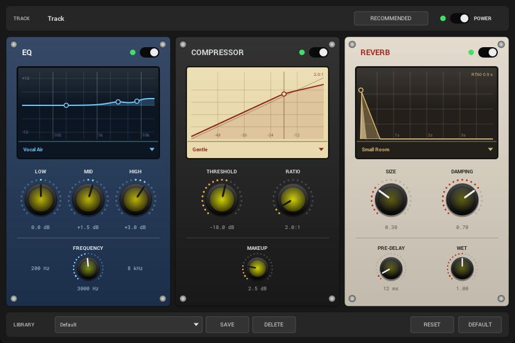

# OpenUtau FX

A VST3 / CLAP / standalone audio effect that brings **OpenUtau**'s per-track
post-processing rack to any DAW.

OpenUtau's *Track Polish* window (the Mix-FX dialog) is a rack of three
hardware-style faceplates — **EQ**, **Compressor** and **Reverb** — each with a
curve screen and a preset selector. This plug-in is that rack, rebuilt as a real
plug-in: the same layout, the same palettes, the same knobs and the same DSP, so
a track polished in OpenUtau sounds the same polished in a host.



## Signal chain

```
input ─▶ BiquadEQ ─▶ SimpleCompressor ─▶ Freeverb ─▶ output
          (power)      (power)             (power)
                                      ▲
                          master power ┘
```

| Module | What it does |
|--------|--------------|
| **EQ** | Three-band biquad from the RBJ Audio EQ Cookbook: low shelf at 200 Hz, a peaking band with a movable centre frequency, high shelf at 8 kHz. |
| **Compressor** | Soft-knee feed-forward compressor with a stereo-linked peak detector and a piecewise-quadratic knee. |
| **Reverb** | Freeverb — eight parallel combs into four series allpasses per channel, with damping in the comb feedback and a pre-delay on the wet path. |

Every power switch crossfades over ~15 ms instead of cutting, and a module that
has just been switched off is reset so its stale tail cannot replay — the same
behaviour as OpenUtau's `MixFxSource`.

## Controls

The rack mirrors the dialog exactly.

| Faceplate | Knobs | Fixed |
|-----------|-------|-------|
| EQ | LOW, MID, HIGH (±12 dB), FREQUENCY (200 Hz – 6 kHz) | 200 Hz / 8 kHz shelf corners |
| Compressor | THRESHOLD (−40 – 0 dB), RATIO (1:1 – 20:1), MAKEUP (0 – 12 dB) | 6 dB knee |
| Reverb | SIZE, DAMPING (0 – 1), PRE-DELAY (0 – 200 ms), WET (0 – 2) | — |

Drag a knob vertically to turn it, hold **Shift** for fine adjustment, use the
mouse wheel or the arrow keys to step, and double-click to reset it to its
default. The tick ring lights up from the origin, which sits at the centre for a
bipolar range like ±12 dB.

Each faceplate also carries a preset selector, and its curve screen redraws from
the live parameters:

* the EQ screen plots the magnitude response over 20 Hz – 20 kHz with a marker
  per band;
* the compressor screen plots the transfer curve from −60 dB to 0 dB in,
  including makeup, with the threshold marked;
* the reverb screen plots the decay over four seconds on a dB scale, showing the
  full-band tail and the shorter high-frequency tail that damping leaves.

## Presets

The bottom bar holds a preset library. The factory entries are full-rack
snapshots — **Default** (the rack OpenUtau recommends for a vocal), **Flat**,
**Vocal Air**, **Pop Lead**, **Warm Hall** and **Ambient**. **SAVE** stores the
current rack under a name you type, **DELETE** removes the selected user preset,
and **RESET** / **DEFAULT** load the flat and recommended racks. User presets
live inside the plug-in's state, so they travel with the project.

## Building

The plug-in builds with CMake against [iPlug 2](https://github.com/iPlug2/iPlug2),
which is vendored as a submodule.

```bash
git clone --recursive https://github.com/KakaruHayate/OpenUTAU-FX.git
cd OpenUTau-FX

# one-off: fetch the plug-in SDKs iPlug 2 needs
(cd iPlug2/Dependencies/IPlug && bash download-vst3-sdk.sh && bash download-clap-sdks.sh)

cmake -B build -DCMAKE_BUILD_TYPE=Release
cmake --build build --config Release
```

The binaries land in `build/out/`. On Windows the Visual Studio generator is
selected automatically — use `cmake -B build -A x64` and
`cmake --build build --config Release`.

Pushing a tag such as `v0.1.0` runs the release workflow, which builds on
Windows, macOS and Linux and attaches the packaged plug-ins to a GitHub release.

## Why these libraries

The interface is drawn by hand through iPlug 2's IGraphics path API on the
NanoVG renderer, and the DSP is a plain header-only C++17 port with no
dependencies. Everything in the stack is permissively licensed:

| Component | Licence |
|-----------|---------|
| iPlug 2 (framework) | zlib-style |
| Cockos WDL, NanoVG, NanoSVG | zlib |
| Roboto, Roboto Mono (bundled fonts) | Apache-2.0 / OFL-1.1 |
| This plug-in | MIT |

No copyleft and no commercial licence is required to build or ship binaries.

## Credits

The DSP and the interface design come from
[OpenUtau](https://github.com/openutau/OpenUtau) (MIT) — `OpenUtau.Core/SignalChain`
and the Mix-FX dialog controls. Freeverb is Jezar at Dreampoint's public-domain
reference implementation.

## Licence

MIT — see [LICENSE](LICENSE).
